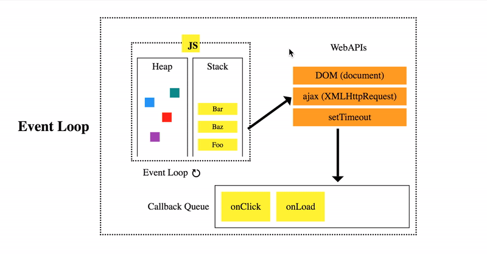

# 실행컨택스트

## 예상 질문

- event loop이란 무엇인가요? call stack과 task queue에 관해 설명해주세요요.
  
  **call stack**: 코드 실행에 따라 스택 프레임이 쌓이는 공간. 후입 선출(LIFO)로 실행.
  **task queue**: Callback Queue 또는 Event Queue 라고도 부른다. Web API에서 보내진 비동기 처리들이 모이게 되고 콜 스택으로 넘어가 처리되기를 기다리는 곳. 선입선출(FIFO) 방식으로 실행.
  **event loop**: call stack에 현재 실행 중인 실행 컨텍스트가 있는지, task queue에 대기 중인 함수가 있는지 반복해서 확인한다. 만약, call stack이 비어있고 task queue에 대기 중인 함수가 있다면 이벤트 루프는 순차적으로 task queue에 대기중인 함수를 call stack으로 이동시킨다. 이때 call stack으로 이동한 함수는 실행된다. 즉, task queue에 일시 보관된 함수들은 비동기 처리 방식으로 동작한다.

- 렉시컬 환경(Lexical Environment)에 대해 설명해주세요.

## 주요 내용

- **실행 컨텍스트를 생성하는 4가지 소스코드**
   
  ECMAScript 사양은 소스코드(ECMAScript code)를 4가지 타입으로 구분하며 이 4가지 타입의 소스코드는 실행 컨텍스트를 생성한다.
   

|        소스코드 타입         |                                                  설명                                                   |
| :--------------------------: | :-----------------------------------------------------------------------------------------------------: |
|  **전역코드(global code)**   |     전역에 존재하는 소스코드를 말하며 전역에 정의된 함수, 클래스, 등의 내부 코드는 포함되지 않는다.     |
| **함수코드 (function code)** | 함수 내부에 존재하는 소스코드를 말하며 함수 내부에 중첩된 함수, 클래스 등의 내부 코드는 포함되지 않는다 |
|   **eval 코드(eval code)**   |                    빌트인 전역 함수인 eval 함수에 인수로 전달되어 실행되는 소스코드                     |
| **모듈 코드 (module code)**  |    모듈 내부에 존재하는 소스코드를 말하며 모듈 내부의 함수, 클래스 등의 내부 코드는 포함되지 않는다.    |

  
 
## 관련 내용

- #hoisting
- [#scope](./scope.md)
- [#closure](./closure.md)
- #IIFE
- #evnet loop(call stack, task queue)
- #this
